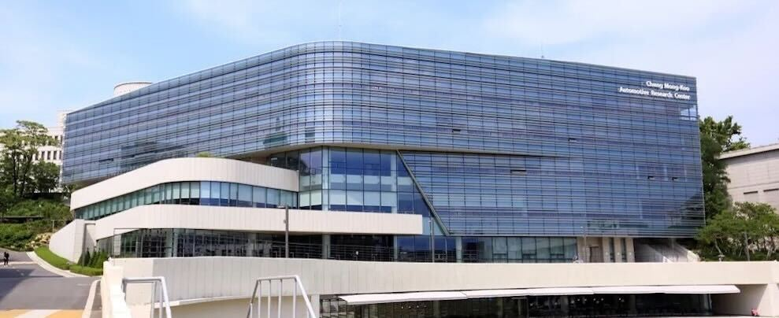

# Dongmin Kim

### 1. Education
#### (1) Hanyang University, Seoul, Republic of Korea
- B.S. in Automotive Engineering (Minor: Data Science)
- Expected Graduation: Feb 2027
  
#### (2)  RWTH Aachen University, Germany
- Faculty of Mechanical Engineering
- Exchange Program (Mar–Aug 2026)

### 2. Affiliation
- [Intelligent Robotics and Computer Vision Lab (IRCV Lab)](https://ircv.hanyang.ac.kr/)  
- Undergraduate Researcher
- Advisor: Prof. Soonmin Hwang

### 3. Research Area
- Vision-centric autonomous driving

### 4. Tools
- Python (PyTorch)
- ROS2
- MATLAB

---

## Maintained Projects

### 🚗 Vision-Centric Autonomous Driving

| Repository | Description | Status |
|----------|------------|--------|
| **KAIST-Mobility-Challenge-H6** | ROS2-based CAV algorithms for KAIST Mobility Challenge 2025 | Public |
| tcar_pkg | 2D traffic light perception and vehicle integration | Private |
| rear-lamp-detection | Rear lamp and signal state detection for driving scenes | Private |
| semantic-stability | Temporal semantic stability metrics for vision models | Private |

---

### 🤖 Robotics

| Repository | Description | Status |
|----------|------------|--------|
| 4-DOF-RobotArm-Project | 4-DOF robotic arm control project | Public |

---

### 📘 Coursework & Study

| Repository | Course | Institution | Instructor |
|----------|--------|-------------|------------|
| EECS-498-007 | Deep Learning for Computer Vision | University of Michigan | Prof. Justin Johnson |
| SOI-1010 | Machine Learning II | Hanyang University | Prof. Sunyong Baik |

---

## Contact

- GitHub: https://github.com/kmin2426
- Email: ehdals1199@hanyang.ac.kr
